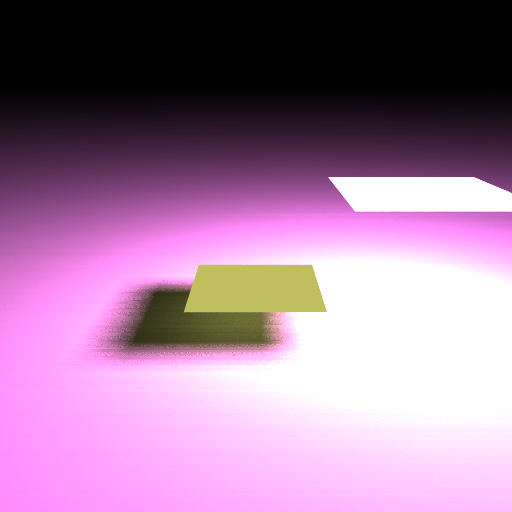

## ray tracing ocl ##

I compare ray tracing(using OpenCL) and ray tracing(using just C)

**result :** 

---
**My Test Computer Spec:**  

- Intel i5-4308U CPU  
- Iris 5100  

---
**C Case** : [source code](https://github.com/DennisJung/ray_tracing_c)  
Operation Time - 336.137s
  
  
**OpenCL GPU Case** : This repository (localWorkSize = 1)  
Operation Time - 2.266s

**OpenCL GPU Optimization Case** : This repository localWorkSize Optimization  
Operation Time - 0.861s
  
    
---
**references**  
[https://github.com/Tecla/Rayito](https://github.com/Tecla/Rayito)  
[smallpt](http://www.kevinbeason.com/smallpt/)